# Fundamentals of Digital Design and Computer Architecture 
# Lecture no 1
<div style="text-align: justify;"> Computer architecture is the science and art of designing computing platforms, including hardware, interface, system software, and programming model. It defines how these components interact to execute programs efficiently and meet specific performance goals. 
<div/>

## What is Computer?
Three key components
- computation 
- Communication 
- Memory/torage 
  <p align="center">
  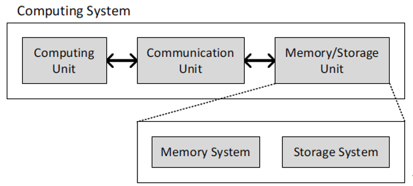
</p>

## The Transformation Hierarchy
- Problem Definition
The initial stage involves identifying and understanding the problem to be solved.
- Algorithm
Developing a step-by-step procedure or set of rules to solve the defined problem.
- Program/Language
Implementing the algorithm using a programming language to create a software program.
- Instruction Set Architecture (ISA)
Defining the set of instructions that the hardware can execute, serving as the interface between software and hardware.
- Microarchitecture
Designing the hardware structures (like pipelines, caches) that implement the ISA.
- Logic Circuits
Creating digital circuits that perform the operations defined by the microarchitecture.
- Transistors and Devices
The physical components (transistors, capacitors) that make up the logic circuits.
- Electrons
The fundamental physical phenomena governing the behavior of electronic devices
  <p align="center">
  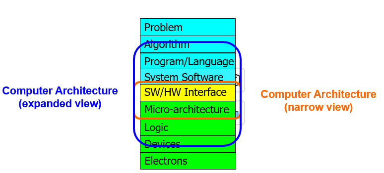
</p>
To achieve the highest energy efficiency and performance we must take the expanded view
of computer architecture

## Building Blocks of Modern Computers
### Transistors
Computers are built from very large numbers of very small (and relatively simple) structures: transistors
- Intel 4004, in 1971, had 2300 MOS transistors
- Intel’s Pentium IV microprocessor, 2000, was made up of more than 42 Million MOS transistors
- Apple’s M2 Max, offered for sale in 2022, is made up of more than 67 Billion MOS transistors
### MOS Transistor
We get a Transistor by combining
- Conductors (Metal)
- Insulators (Oxide)
- Semiconductors
### Different Types of MOS Transistors
There are two types of MOS transistors: n-type and p-type
 <p align="center">
  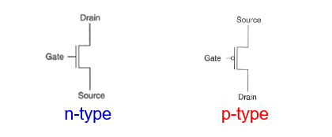
</p>
  
  - **n-type**: Conducts when gate voltage = 3V.  
  - **p-type**: Conducts when gate voltage = 0V. 
  ### Transistor Works As a Switch
  Instead of the wall switch, we could use an n-type or a p-type MOS transistor to make or break the closed circuit
  - If the gate of an **n-type** transistor is supplied with a high voltage, the connection from source to drain acts like a piece of wire (i.e., the circuit is closed)
  - If the gate of the **n-type** transistor is supplied with zero voltage, the connection between the source and drain is broken (i.e., the circuit is open).

**p-type** transistor works in exactly the opposite fashion from n-type transistor
- The circuit is open when the gate is supplied with 3V
- The circuit is closed when the gate is supplied with 0V
### Logic Gates
We construct basic logical units out of individual MOS transistors. These logical units are called logic gates.
They implement simple Boolean functions.

Modern computers use both n-type and p-type transistors, i.e. Complementary MOS (CMOS) technology
<p align="center">
  
</p>

### CMOS Circuit
#### Operation:
- When the input is high (1):

     PMOS is off, NMOS is on → Output is connected to GND  Output is low (0).
- When the input is low (0):

     PMOS is on, NMOS is off → Output is connected to V<sub>DD</sub> → Output is high (1).
<p align="center">
  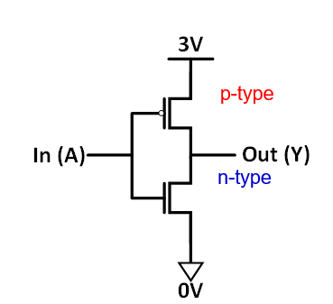
</p>

### General CMOS Gate Structure
  
  The general form used to construct any inverting logic gate, such as: NOT, NAND, or NOR
  - The networks may consist of transistors in series or in parallel
  - When transistors are in parallel, the network is ON if one of the transistors is ON
  - When transistors are in series, the network is ON only if all transistors are ON
  - pMOS transistors are used for pull-up
  - nMOS transistors are used for pull-down
  
<p align="center">
  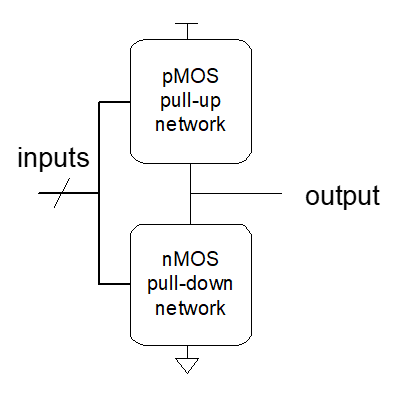
</p>

# Lecture no 2
## Logic Circuits
Build some of the logic structures that are important components of the microarchitecture of a computer
A logic circuit is composed of:
Inputs and Outputs
<p align="center">
  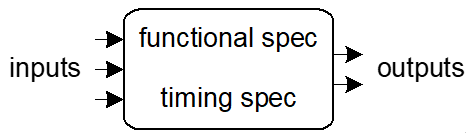
</p>
Functional specification (describes relationship between inputs and outputs)

Timing specification (describes the delay between inputs changing and outputs responding)
#### Types of Logic Circuits
- Combinational Logic:
**Memoryless**
Outputs are strictly dependent on the combination of input values that are being applied to circuit right now

- Sequential Logic: **Has memory**
Structure stores history Can ”store” data values Outputs are determined by previous (historical) and current values of inputs
## Boolean Logic Equations
An algebra on 1’s and 0’s
with AND, OR, NOT operations 
| **Axiom Name**       | **Expression**                                          | **Explanation**                                   |
| -------------------- | ------------------------------------------------------- | ------------------------------------------------- |
| **Identity Law**     | A + 0 = A<br>A · 1 = A                                  | Adding 0 or multiplying by 1 keeps the value same |
| **Null Law**         | A + 1 = 1<br>A · 0 = 0                                  | OR with 1 gives 1, AND with 0 gives 0             |
| **Domination Law**   | A + A̅ = 1<br>A · A̅ = 0                                | A OR NOT A is 1; A AND NOT A is 0                 |
| **Idempotent Law**   | A + A = A<br>A · A = A                                  | Repetition does not change the result             |
| **Complement Law**   | A + A̅ = 1<br>A · A̅ = 0                                | A and its complement give fixed results           |
| **Commutative Law**  | A + B = B + A<br>A · B = B · A                          | Order does not matter                             |
| **Associative Law**  | (A + B) + C = A + (B + C)<br>(A · B) · C = A · (B · C)  | Grouping does not affect result                   |
| **Distributive Law** | A · (B + C) = A·B + A·C<br>A + (B · C) = (A + B)(A + C) | Distribute AND over OR and vice versa             |
| **Involution Law**   | (A̅)̅ = A                                               | Double negation gives the original value          |
| **Absorption Law**   | A + A·B = A<br>A · (A + B) = A                          | Redundant terms can be absorbed                   |
| **De Morgan’s Laws** | (A·B)̅ = A̅ + B̅<br>(A + B)̅ = A̅ · B̅                  | Useful for complementing AND/OR operations        |
###  Standardized Function Representations
- Sum of Products (SOP) form
- Product of Sums (POS) form


**1. Sum of Products (SOP)**

**Definition:**

The **Sum of Products (SOP)** is a Boolean expression format where **two or more product (AND) terms** are **added (OR)** together.
Each product term represents a **minterm**, i.e., a unique input combination for which the output is 1.

**Example:** F = A̅·B + A·B̅ + A·B


**2. Product of Sums (POS)**
**Definition:**

The **Product of Sums (POS)** is a Boolean expression format where **two or more sum (OR) terms** are **multiplied (ANDed)** together.

Each sum term represents a **maxterm**, i.e., a unique input combination for which the output is 0.

**Example:**
F = (A + B̅) · (A̅ + C) · (B + C̅)

## Combinational Building Blocks
Combinational logic is often grouped into larger building blocks to build more complex systems. Some are below:
1. Decoder
2. Multiplexer
3. Full adder
4. PLA (Programmable Logic Array)

### Decoder 
- “Input pattern detector”
- n inputs and 2n outputs
Exactly one of the outputs is 1 and all the rest are 0s
- The output that is logically 1 is the output corresponding to the input pattern that the logic circuit is expected to detect

**Example: 2-to-4 decoder**
<p align="center">
  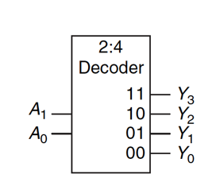
</p>
<div align="center">

###  Decoder Truth Table
| A<sub>1</sub> | A<sub>0</sub> | D<sub>0</sub> | D<sub>1</sub> | D<sub>2</sub> |     D<sub>3</sub> |
| ------------- | ------------- | ------------- | ------------- | ------------- | ------------- |
| 0             | 0             | 1             | 0             | 0             | 0             |
| 0             | 1             | 0             | 1             | 0             | 0             |
| 1             | 0             | 0             | 0             | 1             | 0             |
| 1             | 1             | 0             | 0             | 0             | 1             |
</div>

### Multiplexer (MUX)
- Selects one of the N inputs to connect it to the output.
- based on the value of a log2N-bit control input called select.

**Example: 2-to-1 MUX**
<p align="center">
  
</p>

<div align="center">

###  2-to-1 Multiplexer (MUX) Truth Table

| **S** | **I₀** | **I₁** | **Y (Output)** |
| :---: | :----: | :----: | :------------: |
|   0   |    0   |    X   |        0       |
|   0   |    1   |    X   |        1       |
|   1   |    X   |    0   |        0       |
|   1   |    X   |    1   |        1       |

</div>


**Logic Equation:**

$$
Y = \overline{S} \cdot I_0 + S \cdot I_1
$$

### Programmable Logic Array (PLA)
A Programmable Logic Array (PLA) is a user-configurable logic device used to implement combinational logic circuits. It has:

A programmable AND array

Followed by a programmable OR array

It allows users to define custom logic functions by programming which input combinations (minterms) are AND and then OR together
<p align="center">
  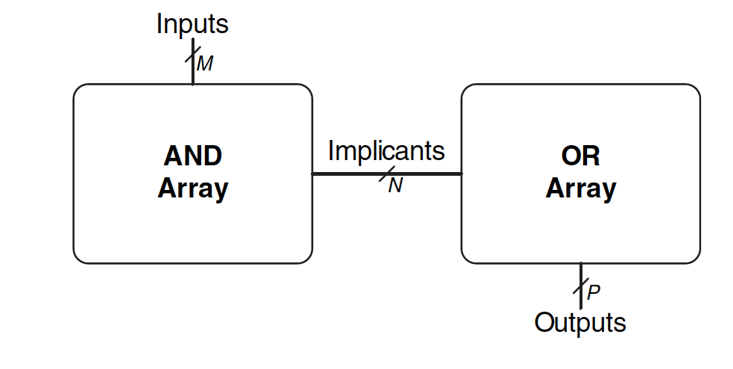
</p>

# Lecture no 3
### Equality Checker (Compare if Equal)
Checks if two N-input values are exactly the same.

**Example: 4-bit Comparator**
<p align="center">
  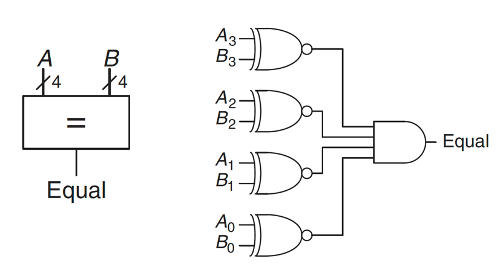
</p>

### ALU (Arithmetic Logic Unit)
Combines a variety of arithmetic and logical operations into a single unit (that performs only one function at a time)

Usually denoted with this symbol:
<p align="center">
  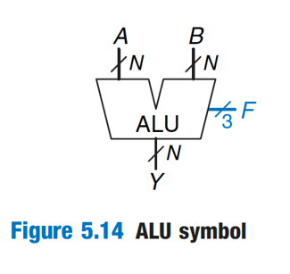
</p>

<div align="center">

### ALU Operation Table (Using 3 Select Lines)

| **S<sub>2</sub>** | **S<sub>1</sub>** | **S<sub>0</sub>** | **Operation** | **Description**    |
| :---------------: | :---------------: | :---------------: | :------------ | :----------------- |
|         0         |         0         |         0         | A + B         | Addition           |
|         0         |         0         |         1         | A - B         | Subtraction        |
|         0         |         1         |         0         | A AND B       | Bitwise AND        |
|         0         |         1         |         1         | A OR B        | Bitwise OR         |
|         1         |         0         |         0         | A XOR B       | Bitwise XOR        |
|         1         |         0         |         1         | A'            | Bitwise NOT (of A) |
|         1         |         1         |         0         | A + 1         | Increment A        |
|         1         |         1         |         1         | A - 1         | Decrement A        |

</div>

### Tri-State Buffer
A tri-state buffer enables gating of different signals onto a wire. A tri-state buffer
acts like a switch.


<div align="center">

### Tri-State Buffer Truth Table

| **Input (A)** | **Enable (E)** | **Output (Y)** |               |
| :-----------: | :------------: | :------------: | :---------------------------- |
|       0       |        1       |        0       |    
|       1       |        1       |        1       | 
|       X       |        0       |        Z       

</div>

## Logic Simplification
Essence of Simplification:
Find two-element subsets of the ON-set where only one variable changes its value.  This single varying variable can be eliminated!

Key Tool:  **The Uniting Theorem**
<p align="center">
𝑭= 𝑨𝑩 + AB'
<p>
<p align="center">
F= 𝑨𝑩 + 𝑨𝑩'=𝑨(𝑩 + 𝑩')=𝑨(𝟏)=𝑨
<p>
If an input (B) can change without changing the output, that input value is not needed
➙ B is eliminated, A remains

### Priority Circuit
Priority Circuit
- Inputs: “Requestors” with priority levels
- Outputs: “Grant” signal for each requestor
**Example 4-bit priority circuit**
<p align="center">
  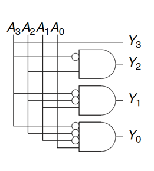
</p>

**4-Input, 4-Output Priority Circuit (Centered Table)**

<div align="center">

| **D₃** | **D₂** | **D₁** | **D₀** | **G₃** | **G₂** | **G₁** | **G₀** |                      
| :----: | :----: | :----: | :----: | :----: | :----: | :----: | :----: 
|    0   |    0   |    0   |    0   |    0   |    0   |    0   |    0   | 
|    0   |    0   |    0   |    1   |    0   |    0   |    0   |    1   | 
|    0   |    0   |    1   |    X   |    0   |    0   |    1   |    0   | 
|    0   |    1   |    X   |    X   |    0   |    1   |    0   |    0   | 
|    1   |    X   |    X   |    X   |    1   |    0   |    0   |    0   |

</div>


---

##  Sequential Circuits

* **Sequential circuits** are digital circuits whose output depends **not only on current inputs but also on past inputs** (i.e., they have memory).
* They consist of **latches** and **flip-flops** which store bits.


##  RS Latch (Basic Latch)

###  What is RS Latch?

* An **RS Latch** is a basic **bistable memory device** with two inputs:

  * **R (Reset)**
  * **S (Set)**
* It has two outputs:

  * **Q** (normal output)
  * **Q'** (complement output)


###  Operation of RS Latch:

| S | R | Q (Next State) | Description          |
| - | - | -------------- | -------------------- |
| 0 | 0 | Q (No change)  | Hold previous state  |
| 0 | 1 | 0              | Reset state          |
| 1 | 0 | 1              | Set state            |
| 1 | 1 | Invalid        | Forbidden (unstable) |

 Circuit:

* Usually made from **two cross-coupled NOR gates** (or NAND gates for active low inputs).
* The outputs feed back to inputs to maintain state.


## How to Make a Gated D Latch from RS Latch

### Goal:

* Create a **D latch** that stores the input data **D** only when the **Enable (EN)** signal is active.
* Use the **RS latch** as the basic memory element, and control inputs S and R from D and EN.


Step 1: Understand the D Latch Inputs

* Input **D** (data)
* Input **EN** (enable)

Step 2: Connect D and EN to RS Inputs

* We want **S** and **R** controlled so that:

  * When **EN = 1**, the latch follows **D**
  * When **EN = 0**, the latch **holds** the previous state (no change)


Step 3: Generate S and R signals from D and EN

| EN | D | S (Set) | R (Reset) |                    |
| -- | - | ------- | --------- | ------------------ |
| 0  | X | 0       | 0         | (Hold state)       |
| 1  | 0 | 0       | 1         | (Reset latch to 0) |
| 1  | 1 | 1       | 0         | (Set latch to 1)   |

Step 4: Logic for S and R:

* **S = D AND EN**
* **R = (NOT D) AND EN**

Step 5: Final Circuit 

* Inputs **D** and **EN** go through gates to produce **S** and **R** inputs for the RS latch.
* RS latch stores the value based on S and R inputs.
* When **EN = 0**, S = R = 0, so latch holds its state.
* When **EN = 1**, latch updates Q to D.


| EN | D | S = D·EN | R = EN·D' | Output Behavior     |
| -- | - | -------- | --------- | ------------------- |
| 0  | X | 0        | 0         | Hold previous state |
| 1  | 0 | 0        | 1         | Reset output to 0   |
| 1  | 1 | 1        | 0         | Set output to 1     |

Absolutely, Nimra! Here’s a polished and well-structured explanation for **Register using D Latches**:

---

# Register 

### What is a Register?

A **register** is a digital storage device composed of multiple flip-flops or latches used to store binary data. It stores multiple bits of information simultaneously and is widely used in CPUs, memory units, and digital systems.

---

### Using D Latches to Build a Register

A **D latch** is a basic memory element that stores a single bit when enabled. By combining several D latches in parallel, you can build a register that stores multiple bits.


### How It Works:

* Each **D latch** stores one bit of data.
* All latches share a common **Enable (EN)** signal.
* When **EN = 1 (enabled)**, the latch is **transparent** — the output **Q** follows the input **D**.
* When **EN = 0 (disabled)**, the latch **holds** (stores) the last value at its output **Q**.
* By applying the **Enable signal simultaneously** to all latches, the register stores the entire multi-bit word in parallel.


### Operation Table (for each D latch)

| Enable (EN) | Input (D)      | Output Q (Next State)       |
| ----------- | -------------- | --------------------------- |
| 0           | X (don’t care) | Holds previous output value |
| 1           | 0              | Output Q = 0 (follows D)    |
| 1           | 1              | Output Q = 1 (follows D)    |

# Flip-Flop 

* A **flip-flop** is like a latch but **edge-triggered**: it changes its output only on a **specific clock edge** (rising or falling).
* This makes flip-flops very important in synchronous digital circuits, where all elements update their outputs simultaneously on clock edges.
* A **D flip-flop** stores the input data only at the moment of the clock edge (e.g., rising edge).

Building a Flip-Flop from D Latches 

* A common way to make an edge-triggered D flip-flop from level-sensitive latches is to use **two gated D latches in series**:

  * **Master latch** (enabled when CLK=0)
  * **Slave latch** (enabled when CLK=1)
* How it works:

  * When CLK=0, Master latch is transparent and follows input D; Slave latch holds previous data.
  * When CLK changes to 1, Master latch holds last input, Slave latch becomes transparent and takes data from Master latch — output updates only on clock edge.


##  Using D Flip-Flops to Build Memory

* Since 1 D flip-flop stores 1 bit, multiple D flip-flops can store multiple bits.
* For example, an **8-bit memory cell** uses 8 D flip-flops — each storing 1 bit.
* This group of flip-flops is called a **register**.


| Signal      | Purpose                       |
| ----------- | ----------------------------- |
| D (Data In) | Input data to be stored       |
| CLK         | Clock signal controls storing |
| Q (Output)  | Stored data output            |

### Operation:

* When the clock signal **rises**, the D flip-flop stores the value of D.
* The stored value is held at Q until the next clock edge.


## Writing Data into Memory

* To **write** data, provide the input bits on D lines.
* Pulse the clock (CLK) to store the data into the flip-flops.
* The flip-flops latch the data on the clock edge.

##  Reading Data from Memory

* The stored data appears at the **Q outputs** of the flip-flops.
* Reading is just accessing these outputs.
* Since D flip-flops store data, the outputs continuously reflect stored bits.
# Lecture no 4

### Finite State Machines (FSMs)

Finite State Machines (FSMs) are a fundamental concept in digital design used to model sequential logic circuits. They help control system behavior by transitioning between different states based on inputs and generating outputs.

---

### **Parts of an FSM:**

| Part                 | Description                                                                               |
| -------------------- | ----------------------------------------------------------------------------------------- |
| **State Register**   | Stores the current state of the FSM (memory element).                                     |
| **Next-State Logic** | Combinational logic that determines the next state based on the current state and inputs. |
| **Output Logic**     | Generates outputs based on the state and inputs:                                          |
|                      | - **Moore Machine:** Output depends **only on current state**.                            |
|                      | - **Mealy Machine:** Output depends on **current state and inputs**.                      |

---

### **Design Steps for FSM:**

1. **Define States**
   Identify all the distinct conditions or states your system can be in.

2. **Encode States**
   Assign binary codes (e.g., 2-bit, 3-bit) to each state for implementation in hardware.

3. **Create Logic**

   * Develop next-state logic using current state and inputs to determine the next state.
   * Design output logic based on whether it's a Moore or Mealy FSM.

---

### Summary Table:

| FSM Part         | Role                          | Depends On                    |
| ---------------- | ----------------------------- | ----------------------------- |
| State Register   | Stores current state (memory) | Previous state and clock      |
| Next-State Logic | Computes next state           | Current state and inputs      |
| Output Logic     | Produces output signals       | Moore: current state only     |
|                  |                               | Mealy: current state + inputs |


### Hardware Description Languages (HDLs) & Verilog

---

## What are HDLs?

* Languages to **describe hardware structure and behavior**.
* Allow **simulation** (functional and timing).
* Enable **synthesis**: generate actual hardware (gates, wiring) from high-level code.


## Why Use HDLs?

* Model **hardware parallelism** naturally.
* Manage complexity with **module hierarchy**.
* Easier to **design, simulate, verify** complex circuits.

---

## Design Methodologies

| Type      | Description                                         |
| --------- | --------------------------------------------------- |
| Top-Down  | Start from high-level, break down modules to gates. |
| Bottom-Up | Start with gates, build up to modules.              |


## Two Main HDL Styles

| Style      | Description                                      | Examples                                |
| ---------- | ------------------------------------------------ | --------------------------------------- |
| Structural | Describe hardware connections (gates, modules).  | Instantiate gates (`and`, `or`, `not`). |
| Behavioral | Describe circuit behavior using procedural code. | `assign`, `always`, `if`, `case`.       |


## Basic Verilog Syntax

* Case-sensitive.
* Names **cannot start with numbers**.
* Whitespaces ignored.
* Comments: `// single line`, `/* multi-line */`.

---
# Lecture no 5
## Bit Slicing, Concatenation & Duplication

```verilog
// Define a bus
wire [15:0] longbus;

// Slicing (extract bits 12 to 5)
wire [7:0] shortbus = longbus[12:5];

// Concatenation
assign y = {a[2], a[1], a[0]};

// Duplication
assign y = {a[0], a[0]};
```

---

## How to Express Numbers

* Format: `N'Bxx`
* `N` = number of bits, `B` = base (b=bin, d=dec, h=hex), `xx` = value
  Example:

```verilog
4'b1010  // 4-bit binary 1010
8'hFF    // 8-bit hex FF
```

---

## Conditional Assignments

```verilog
assign y = s ? d1 : d0;  // if s=1 then y=d1 else y=d0
```

---

## Operator Precedence

* Use parentheses for clarity.
* Example: `y = (a & b) | c;`

---

## Example: Comparing Two Numbers

```verilog
assign greater = (a > b);
```

---

## Parameterized Modules

```verilog
module example #(parameter WIDTH = 8) (
    input [WIDTH-1:0] a,
    output [WIDTH-1:0] y
);
// module body
endmodule

// Instantiation with parameter override
example #(16) inst1 (.a(data_in), .y(data_out));
```

---

## Timing (Simulation Only)

```verilog
#10 a = 1;  // Wait 10 time units then assign a = 1
```


## Sequential Logic in Verilog

* Use `always` block with `posedge` or `negedge` of clock.
* Use **non-blocking assignments (`<=`)** for sequential logic.
* Use synchronous or asynchronous resets.
* Example: D Flip-Flop with reset and enable:

```verilog
always @(posedge clk or posedge reset) begin
    if (reset)
        q <= 0;
    else if (enable)
        q <= d;
end
```

* Use `always @*` for combinational logic.

---

## Difference Between Combinational and Sequential Logic

| Feature           | Combinational             | Sequential                    |
| ----------------- | ------------------------- | ----------------------------- |
| Memory            | No                        | Yes (stores past input/state) |
| Clock dependency  | No                        | Yes (triggered on clock edge) |
| Sensitivity list  | `always @(*)` or `assign` | `always @(posedge clk)`       |
| Assignment style  | Blocking (`=`) or assign  | Non-blocking (`<=`)           |
| Output depends on | Current inputs only       | Current inputs + past states  |
| Example use       | Logic gates, adders, MUX  | Flip-flops, registers, FSMs   |

---

## Writing Sequential Circuits: Finite State Machines (FSM)

* Use `case` statements inside `always @(posedge clk)` block.
* Keep state variables and outputs in registers.

---

## Timing and Verification

* Simulation checks **functional correctness** and **timing** before hardware fabrication.
* Verification ensures design meets specs.

---

## Circuit Design Trade-Offs

| Factor      | Description                            |
| ----------- | -------------------------------------- |
| Area        | Size of the circuit (number of gates)  |
| Speed       | How fast it operates (clock frequency) |
| Power       | Energy consumption                     |
| Design Time | Development time                       |

---

# Simple D Flip-Flop in Verilog

```verilog
module d_flip_flop (
    input clk,
    input reset,
    input d,
    output reg q
);

always @(posedge clk or posedge reset) begin
    if (reset)
        q <= 0;
    else
        q <= d;
end

endmodule
```


###  **1. Timescale Directive**

```verilog
`timescale 1ns / 1ps
```

* `1ns`: **Time unit** used in delays (like `#5` = 5ns).
* `1ps`: **Time precision** of the simulation.

---

###  **2. Verilog Module with #5 Delay**

```verilog
`timescale 1ns / 1ps

module and_gate_with_delay (
    input wire a,
    input wire b,
    output reg y
);

    always @ (a or b) begin
        #5 y = a & b; // y is updated 5ns after inputs change
    end

endmodule
```
# Lecture no 6


 ## Combinational Circuit Timing

In purely combinational circuits (no memory elements), output depends only on current input.

#### **Types of Delay:**

| Delay Type                               | Meaning                                                                    |
| ---------------------------------------- | -------------------------------------------------------------------------- |
| **Contamination Delay (t<sub>cd</sub>)** | Minimum delay from input to any output change. "Earliest effect."          |
| **Propagation Delay (t<sub>pd</sub>)**   | Maximum delay from input to output becoming valid/stable. "Latest effect." |

 **Glitches**

* Caused when different paths have different delays.
* Often harmless if final output settles correctly.

**Critical Path**

* The longest logic path from input to output.
* Determines **maximum clock frequency** in sequential circuits.

---

###  Sequential Circuit Timing

Sequential circuits include **flip-flops** or **latches** and require clocking.

#### **Key Timing Parameters:**

| Parameter                                | Meaning                                                   |
| ---------------------------------------- | --------------------------------------------------------- |
| **Setup Time (t<sub>setup</sub>)**       | Input **must be stable before** clock edge (data ready).  |
| **Hold Time (t<sub>hold</sub>)**         | Input **must stay stable after** clock edge.              |
| **Clock-to-Q Delay (t<sub>clk→Q</sub>)** | Time for flip-flop to update its output after clock edge. |
| **Clock Skew**                           | Delay difference in clock arrival at two flip-flops.      |


### Timing Violations & Fixes

| Violation           | Cause                                  | Fix                                                              |
| ------------------- | -------------------------------------- | ---------------------------------------------------------------- |
| **Setup Violation** | Path too slow. Data not ready in time. |  Reduce clock freq<br>Optimize logic<br> Add pipeline stages |
| **Hold Violation**  | Path too fast. Data changes too early. |  Add delay buffers<br>Avoid fast combinational paths          |

---

###  **. Circuit Verification**

| Type                          | What It Does                                                             |
| ----------------------------- | ------------------------------------------------------------------------ |
| **Functional Verification**   | Ensure logic does what it's supposed to. Use testbenches.                |
| **Timing Verification**       | Includes simulation **with delays**, or **Static Timing Analysis (STA)** |
| **Post-Synthesis Simulation** | Simulate gate-level delays after synthesis. More accurate.               |
| **Formal Verification**       | Use mathematical checks (e.g., **SystemVerilog Assertions**)             |

---

### **Verilog Simulation Example**

```verilog
`timescale 1ns/1ps

module simple_and (input a, input b, output y);
    assign #3 y = a & b; // propagation delay of 3ns
endmodule
```

**Simulation Interpretation:**

* Input changes → Wait 3ns → Output changes
* Use `#` delay for **propagation modeling only**, not synthesis.

# References

- https://www.youtube.com/watch?v=ubhxKNlOlRg&list=PL5Q2soXY2Zi9Eo29LMgKVcaydS7V1zZW3&index=1

- https://www.youtube.com/watch?v=U-4jmbm8inw&list=PL5Q2soXY2Zi9Eo29LMgKVcaydS7V1zZW3&index=2

- https://www.youtube.com/watch?v=smHJ1W7S-2Q&list=PL5Q2soXY2Zi9Eo29LMgKVcaydS7V1zZW3&index=3

- https://www.youtube.com/watch?v=KcP1ky8_U7w&list=PL5Q2soXY2Zi9Eo29LMgKVcaydS7V1zZW3&index=6

- https://www.youtube.com/watch?v=3Sqt0GIFPbc&list=PL5Q2soXY2Zi9Eo29LMgKVcaydS7V1zZW3&index=7

- https://www.youtube.com/watch?v=DBsDuQwpPsI&list=PL5Q2soXY2Zi9Eo29LMgKVcaydS7V1zZW3&index=8